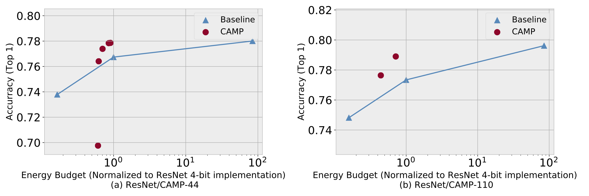

# Co-Adaptive-Mixed-Precision-CNNs
Official implement of CAMP: Co-Adaptive Mixed-Precision Convolutional Neural Networks




## Environment

- Anaconda 5+ with py3.7
- create conda virtual environment
- (conda install) pytorch-1.0.1 (1.1 not tested)
- (follow docs as listed) distiller-0.3.1

## Install distiller

- Download distiller-0.3.1 from https://github.com/NervanaSystems/distiller/archive/v0.3.1.tar.gz
- `tar zxf v0.3.1.tar.gz` and `cd distiller-0.3.1`
- edit line 87 @`distiller/quantization/quantizer.py` as below:

```
# if train_with_fp_copy and optimizer is None:
#     raise ValueError('optimizer cannot be None when train_with_fp_copy is True')
```

- <b>!!!Important!!!<b> replace `distiller/quantization/clipped_linear.py` with ./clipped_linear.py

- (activated conda env) python3 setup.py install

## Running experiments

### Hyper parameters

- Your imagenet data folder: `data.imagenet` or edit script to fit the running environment, absolute path supported
- a / arch_dual: model architecture, do not change
- lr: learning rate
- p: frequency of print status(steps)
- b: batchsize
- j: number of multiprocessing dataloader
- epochs: number of training epochs
- compress: config file path, do not change
- wd: weight decay
- vs: validation split rate, set 0 is good enough(useless for imagenet)
- gpus: multi-gpu support, for single gpu: use --gpus 0, otherwise --gpus 1,2,3...
- name: experiment name, do not change
- dataset: set imagenet dataset, do not change

### Training procedure

1. Training 32-bits baseline model

```
python3 train.py -a preact_resnet44_cifar \
                      --lr 0.1 -p 50 -b 128 data.cifar10 -j 1 \
                      --epochs 200 \
                      --compress=./configs/preact_resnet_cifar_base_fp32.yaml \
                      --wd=0.0002 --vs=0 --gpus 0 --name exp1_fp32
```

2. Quantized-aware training: 
    - 4-bits model
    ```
    python3 train.py -a preact_resnet44_cifar \
                         --lr 0.1 -p 50 -b 128 data.cifar10 -j 1 \
                         --epochs 200 \
                         --compress=./configs/preact_resnet20_cifar_pact_fp4.yaml \
                         --out-dir="logs/" --wd=0.0002 --vs=0 --gpus 0 --name exp1_fp4
    ```
    - 1-bit model
    ```
    python3 train.py -a preact_resnet44_cifar \
                         --lr 0.1 -p 50 -b 128 data.cifar10 -j 1 \
                         --epochs 200 \
                         --compress=./configs/preact_resnet20_cifar_pact_bool.yaml \
                         --out-dir="logs/" --wd=0.0002 --vs=0 --gpus 0 --name exp1_fp4
    ```

3. Co-adaptive mixed precision:
    - Supervisied training:
    ```
    python3 train_sp.py -a preact_resnet44_cifar \
                        --arch_dual preact_resnet44_cifar_dualpath \
                        --lr 0.01 -p 50 -b 128 data.cifar10 -j 1 --epochs 200 \
                        --compress=./configs/bitskip_sp.yaml \
                        --wd=0.0002 --vs=0 --gpus 0 --name exp1_bitskip_sp \
                        --resume logs/<your_4bits_model.pth.tar>
    ```
    - Reinforcement learning:
    ```
    python3 train_rl.py -a preact_resnet44_cifar_dualpath_rl \
                        --lr 0.01 -p 50 -b 128 data.cifar10 -j 1 --epochs 200 \
                        --compress=1+4/configs/bitskip_rl.yaml --wd=0.0002 --vs=0 \
                        --gpus 0 --name exp1_bitskip_rl_1  --alpha=0.1 \
                        --resume=logs/<your_supervisied_model.pth.tar>
    ```
